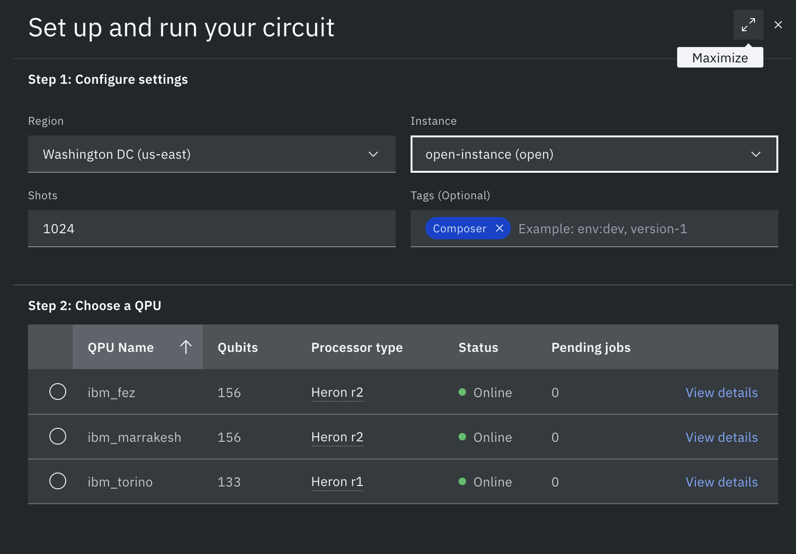

# HW03 Instructions – ESE50590 (Fall 2025, University of Pennsylvania)

This README provides setup and execution instructions for the quantum circuits homework. It builds on IBM Quantum's "Hello World" tutorial and guides you through running and modifying the provided example notebook (`example.ipynb`).

### Good reference for cloud web interface and QASM as your main submission is on cloud sim and then real backend run:
https://quantum.cloud.ibm.com/docs/en/guides/composer
https://quantum.cloud.ibm.com/docs/en/guides/introduction-to-qasm
I prefer QASM but you can also use the Composer interface to build circuits visually and export QASM from there.

Directly start playing with https://quantum.cloud.ibm.com/docs/en/guides/composer see and explore how to deploy the circuit job on actual QH instance real qubit.


## Learning Objectives
1. Authenticate and interact with IBM Quantum Platform.
2. Construct, transpile, and simulate a simple 2–qubit Bell / Deutsch–Jozsa style circuit.
3. Collect and interpret measurement counts using the Sampler primitive.
4. Practice secure handling of API credentials. # out of scope !

## Repository Contents
- `example.ipynb`: Starter notebook showing a Bell circuit with `SamplerV2`.
- `hw3_p3.ipynb`: Placeholder / problem notebook (edit per assignment instructions).
- `requirements.txt`: Python dependencies list.
- `README.md`: (This file).

## Prerequisites
- Python 3.9+ recommended.
- macOS (as in course environment) with `zsh` shell.
- An IBM Quantum Platform account (Open Plan is sufficient).

## 1. Create / Verify IBM Quantum Account
1. Visit https://quantum.cloud.ibm.com/ and sign in or create an account.
2. Navigate to Dashboard and generate your API Token (44‑character string). Do NOT commit it to Git.
3. (Optional) Locate an instance CRN under Instances page if you plan to target a specific instance.

## 2. Securely Store Your Token
Prefer environment variables over hard‑coding.

In your terminal (zsh):
```bash
export IBM_QUANTUM_TOKEN="<your-token>"
export IBM_QUANTUM_CRN="<optional-crn>"  # leave unset if not needed
```

Inside a Python session / notebook you can instantiate the service without embedding the token directly if you've previously saved your account:
```python
from qiskit_ibm_runtime import QiskitRuntimeService
service = QiskitRuntimeService(token=os.environ["IBM_QUANTUM_TOKEN"], instance=os.getenv("IBM_QUANTUM_CRN"))
```

Alternatively, one‑time local save (writes credentials to disk):
```python
from qiskit_ibm_runtime import QiskitRuntimeService
QiskitRuntimeService.save_account(token="<your-token>", instance="<CRN>")  # CRN optional
# Later:
service = QiskitRuntimeService()
```
Do not run `save_account` on shared lab machines.

## 3. Install Dependencies
From the repository root:
```bash
python -m venv .venv
OR see which python version macro works for you
python3 -m venv .venv

source .venv/bin/activate
pip install -r requirements.txt
```
If individual installs are needed:
```bash
pip install qiskit-ibm-runtime qiskit-aer matplotlib pylatexenc
```

## 4. Open and Run the Starter Notebook
1. Launch Jupyter (or VS Code notebook interface).
2. Open `example (1).ipynb`.
3. Replace the placeholder `token = "..."` line with a secure method (environment variable or `save_account`).
4. Execute cells top to bottom:
	- Cell 2: Imports.
	- Cell with token: Modify as described above.
	- Circuit construction: Adjust gates as needed for your homework variant.
	- Simulation & Sampler: Produces counts.
	- Plot: Visualizes measurement distribution.

## 5. Homework Task Guidance (Deutsch–Jozsa Adaptation)
For a 2‑qubit Deutsch–Jozsa demonstration:
// f1 constant 1
// f2 balanced x
// f3 balanced not x
// f4 constant 0


## 6. Transpilation and Optimization
The example uses `generate_preset_pass_manager` with `optimization_level=1`. 
(optional) You may explore levels 0–3 and record differences in depth / basis gates. Keep circuits shallow to reduce noise (important when moving from Aer to real backends).

## 7. Simulators vs Real Backends
- Aer (`AerSimulator`) gives idealized + noise models if configured.
- Real device submission requires queue time; consider starting early.

## 8. Results & Reporting
Include in your submission:
1. Circuit diagram (MatPlotLib rendering).
2. Raw counts dictionary.
3. Bar plot of counts.
4. Brief interpretation (1–2 lines) relating outcome to oracle type.
5. (optional) Notes on any discrepancies vs expected (e.g., small simulator statistical variance).

Note! you have to schedule and run on a real backend on https://quantum.cloud.ibm.com/ as main part of the homework.

## 9. Common Issues (not part of Hw)
- Invalid token: Re‑generate from dashboard; ensure no hidden whitespace.
- `ImportError`: Re‑install `qiskit-ibm-runtime` or activate the virtual environment.
- Empty counts: Ensure `qc.measure_all()` executed before sampler run.
- Backend selection failures: Remove strict filters or fall back to Aer.

## 10. Academic Integrity & Credential Hygiene
Refer University policies on academic honesty. https://catalog.upenn.edu/pennbook/code-of-academic-integrity/
- Do not share API tokens in screenshots or commits.
- Commit only code & derived plots (not secrets).
- If you accidentally commit a token, revoke it immediately in the dashboard.

## 11. Optional Extensions for the curious (not part of HW)
If ahead of schedule, explore:
- Estimator primitive for expectation values.
- Scaling to GHZ states (see tutorial section on 100‑qubit GHZ – only simulate locally with small n).
- Resilience options (`estimator.options.resilience_level`).

## Reference
IBM Quantum "Hello World" Tutorial: https://quantum.cloud.ibm.com/docs/en/tutorials/hello-world
Bit Ordering Guide: https://quantum.cloud.ibm.com/docs/guides/bit-ordering

## Submission Checklist
```text
[ ] Circuit diagram included
[ ] Counts & plot included
[ ] Oracle description & expected vs observed analysis
[ ] README reviewed for accuracy
```

---
### Contact

- Teaching Assistant: Nikhil Schahal — nschahal@seas.upenn.edu (preferred: course Slack channel)  
- Instructor: Prof. Anthony Sigillito — https://directory.seas.upenn.edu/anthony-sigillito/

For general course questions use the Slack channel first; email for attachments or private matters.

